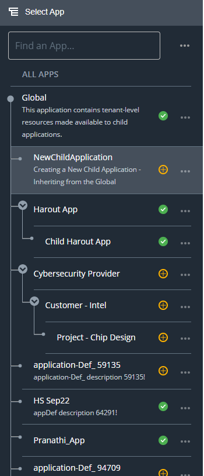

# Application Hierarchy and Interitence
---

## Introduction 

This article explains how hierarchies are maintained in the **Emgage** platform and how you can make use of this feature to build efficient applications.

In the **Emgage** platform, every app is associated to a parent. Under every new app, further apps can be created and so on. This hierarchical structure can be extended to any level as per requirement.

## Application Hierarchy 
- From the Dashboard, navigate to;  **`Left Nav Bar`**  and click the **`Select App`** button. You will see a screen as shown below.

    

- At the root, you will see a system defined app called **Global**.
    - **Global** app is the parent of all apps created in **Emgage**.
    - All child apps inherit properties, resources or controls defined in the **Global** app.
    - If you want to create an app that inherits resources defined in the Global app only, then choose the **Global** app and refer to [**Create Application Guide**](create-application-introduction.md) for create a new application.
- Endless hierarchy levels can be created in **Emgage**. 
    - Refer to the above screen, the app **Project- Chip Design** is created under the parent named **Customer - Intel**, which is created under the parent **Cybersecurity Provider**.
    - Note that the parent application named **Cybersecurity Provider** lies under the source app named **Global**.
- No app can be created above **Global**.  

## Resource Inheritance in Application Hierarchy 
- In simple terms, Inheritance means reception of resources or properties from parent to the child. 
- When a child app is created in **Emgage**, all properties, resources or controls of the parent are automatically available in the child app.
- New properties, resources or controls created in the child app are available to the child app only and are not reflected in any other app or its parent app.

- Refer to the Hierarchy Levels in the figure above, the Inheritance of app resources for the **Project- Chip Design** are;
    - All the resources available in the app named **Customer - Intel**. 
    - All the resources available in the app named **Cybersecurity Provider**.
    - All the resources available in the app named **Global**.
- The Inheritance of app resources for the **Customer - Intel** are;
    - All the resources available in the app named **Cybersecurity Provider**.
    - All the resources available in the app named **Global**.
- **Global** is the parent of all apps.

