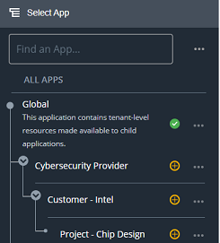

# Create Application Using App Manager
---

## Introduction 
This article explains how you can create an application using the **App Manager**. After reading this article, you should be able to Create an Application Using the App Manager as well as perform **Search**, **Publish** and **Delete** operations on the application.

## Pre-Reqs 

- User must be logged in.  
- User must have necessary permissions.

## Step-by-Step Instructions 

- From the Dashboard, navigate to;  **`Left Nav Bar`**  and click the **`Select App`** button. You will see a screen as shown below.  

    

- Click **`(...)`**, and select **`Child App`** option from the menu. After the system processess your request, you will see a screen as shown below.  

    

- You can enter any appropriate name for the application. Based on the name, the system automatically suggests a unique identifier for the new application. You can update the Indentifier as per need, however it must be unique. The identifier may contain alphabets, digits or special characters.

- To view advanced options, click the **`Show Advanced`** link to view the scteen as shown below.  

    

- To save the newly created application as a draft, click the **`Save Draft`** button. The draft application will be available to the current user only. To directly Publish the new app, click the **`Publish`** button.

- To close this window without maing any change, click the **`Close`** button