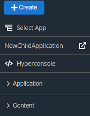
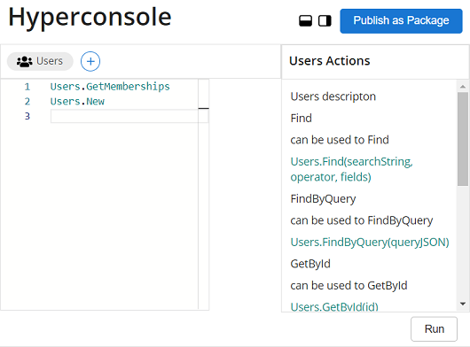

# Create Application Using Hyperconsole
---

## Introduction 
This article explains how you can create an application using the **Hyperconsole**. **Hyperconsole** is a commandline like rich editor where you can specify instructions to create your required application. You can include resources from **Content Store** and can call functions for specific actions.

## Pre-Reqs 

- User must be logged in.  
- User must have necessary permissions.

## Step-by-Step Instructions 

- From the Dashboard, navigate to;  **`Left Nav Bar`**  and click the **`Hyperconsole`** button. Refer to the screen shown below.  

    

- The **Hyperconsole** editor looks like the screen shown below.  

    
