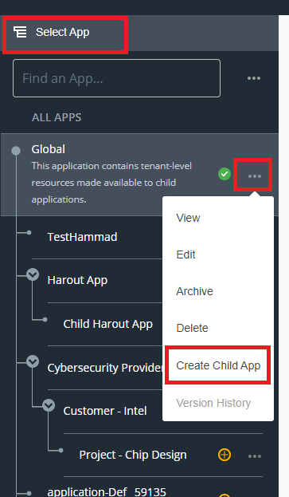
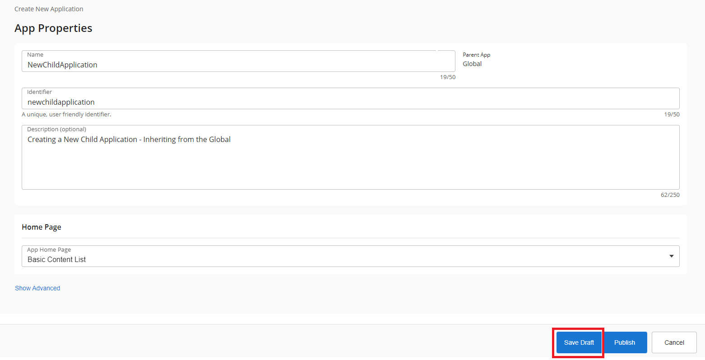
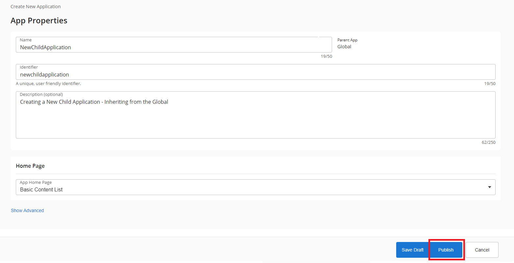
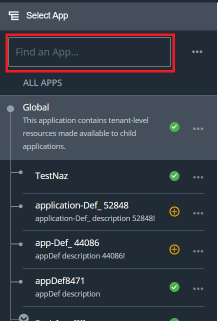
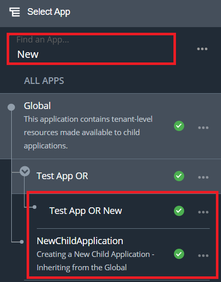
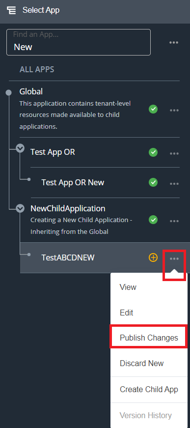
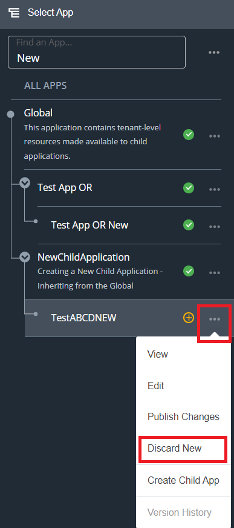
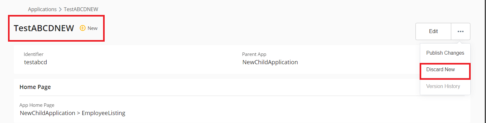
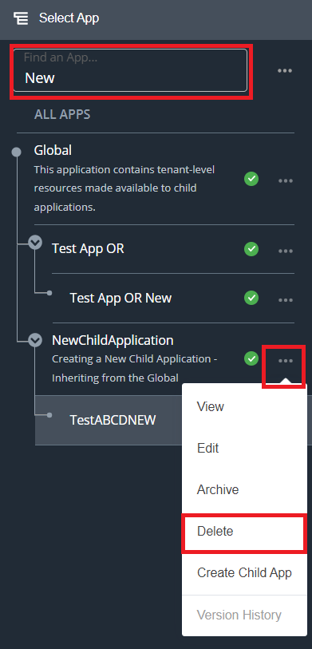
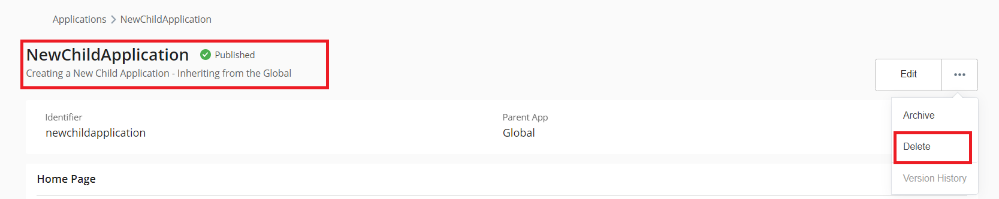

# Create a New Child Application Using App Builder

## Introduction 
 

⭐ This page explains in simple steps, how you can create a new child application in Emgage using the Using App Builder feature.

⭐ After completing this page, you should be able to do the following tasks.

➡️ Create a new draft app.  
➡️ Create and Publish a new app.  
➡️ Search an app.  
➡️ Publish a draft app.  
➡️ Discard a draft app.  
➡️ Delete an app.  

 

## Pre-Reqs 
 

✅  User must be logged in.  
✅  User must have necessary permissions.

 

## Step-by-Step Instructions 
 

### Create a new draft app 

 

1. From the Dashboard, navigate to;  `Left Nav Bar` and click the `Select App `button. You will see a screen as shown below.
    
 

 

2. Click the `Three Dots (...)`. 

1. Select `Child App` option from the menu.
    - The system will initialize an application wizard that will create your application in the background. 
    - This may take a little while to process.

 

4. Once complete, you will see a screen as shown below.

    

 

5. To save the newly created application as a draft, click the `Save Draft` button.
    - *Note: The draft application is available to the current user only.*

 

6. To close this screen without saving, click the `Cancel` button.

 

7. That's it, you have successfully created your first draft app using **Emgage**.

 

  **[🔝](#introduction)**

---

 

## ✴️ Create and Publish a new app 
 

1. From the Dashboard, navigate to `Left Nav Bar`  and click the `Select App` button. You will see a screen as shown below.

    

 

 

2. Click the `Three Dots (...)`. 

1. Select `Child App` option from the menu.
    - The system will initialize an application wizard that will create your application in the background. 
    - This may take a little while to process.

 

4. Once complete, you will see a screen as shown below.

    

1. To directly Publish the new app, click the `Publish` button.
1. That's it, you have successfully created and Published your first app using **Emgage**.

 

  **[🔝](#introduction)**

---

 

## ✴️ Search an app 
 

1. From the Dashboard, navigate to `Left Nav Bar` and locate the `Find an App` search bar as shown in the figure below.

    

 

2. Type in the name of the app that you need to search. The **Emgage** system will filter all apps that match your specific search criteria. Please refer to the figure shown below.
  
    

 

  **[🔝](#introduction)**

---

 

## ✴️ Publish a draft app 
 

1. From the Dashboard, navigate to `Left Nav Bar` and locate the `Find an App` search bar as shown in the figure below.

    

 

 2. Type in the name of the app that you need to search. The **Emgage** system will filter all apps that match your specific search criteria. Please refer to the figure shown below.

    

 

3. To Publish the app, click the `Publish Changes` button.
    - This may take a little while to process.
    - Once complete, you will see your app in the `Left Nav Bar`

 

4. Or alternatively, click the application to view the screen as shown below. Click the `Publish Changes` button to Publish the draft app.
    
    

 

  **[🔝](#introduction)**

---

 

## Discard a draft app 
 

 

1. From the Dashboard, navigate to `Left Nav Bar` and locate the `Find an App` search bar as shown in the figure below.

    

 

 2. Type in the name of the app that you need to search. The **Emgage** system will filter all apps that match your specific search criteria. Please refer to the figure shown below.

    

 

3. To discard the newly created draft app, click the `Discard New` button.
    - This may take a little while to process.

 

4. Or alternatively, click the application to view the screen as shown below. Click the `Discard New` button to discard the draft app.
    
    

 

 [🔝](#introduction)

---

 

## ✴️ Delete an app 
 

1. From the Dashboard, navigate to `Left Nav Bar` and locate the `Find an App` search bar as shown in the figure below.

    

 

 2. Type in the name of the app that you need to search. The **Emgage** system will filter all apps that match your specific search criteria. Please refer to the figure shown below.

    

 

3. To Delete the Published app, click the `Delete` button.
    - This may take a little while to process.

 

4. Or alternatively, click the application to view the screen as shown below. Click the `Delete` button to Delete the app.
    
    

 

 